## Introduction
This is a web management system which allows a user to monitor, edit, create a new issue for his/her purchased device.
*Note that the source codes are not open for public.*

## Example
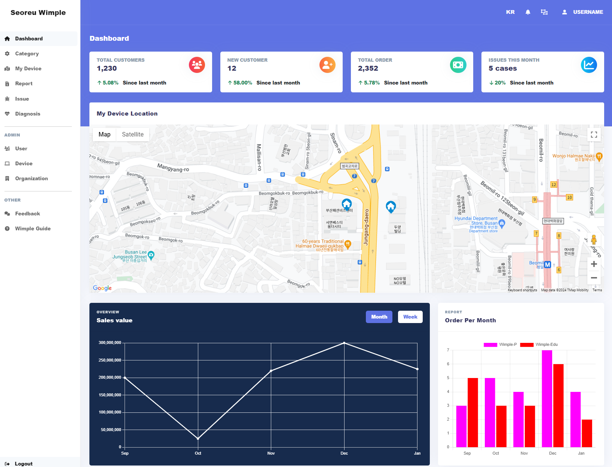
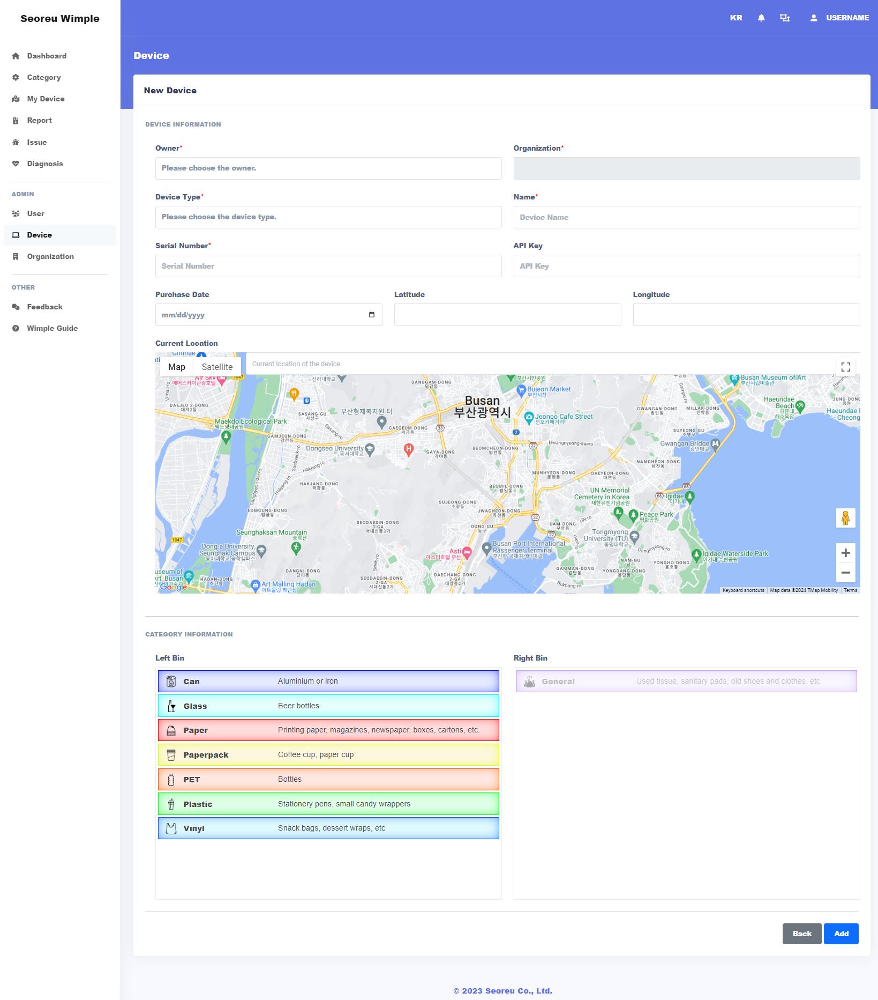
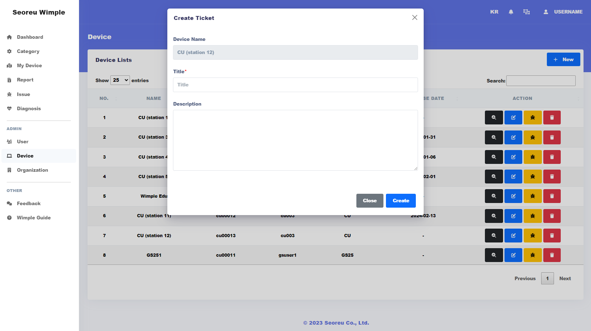
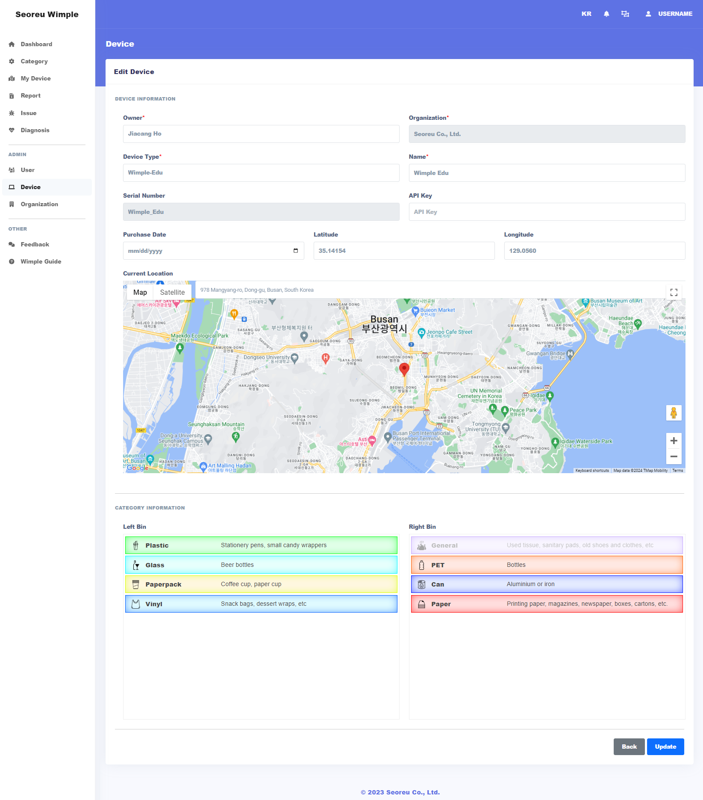
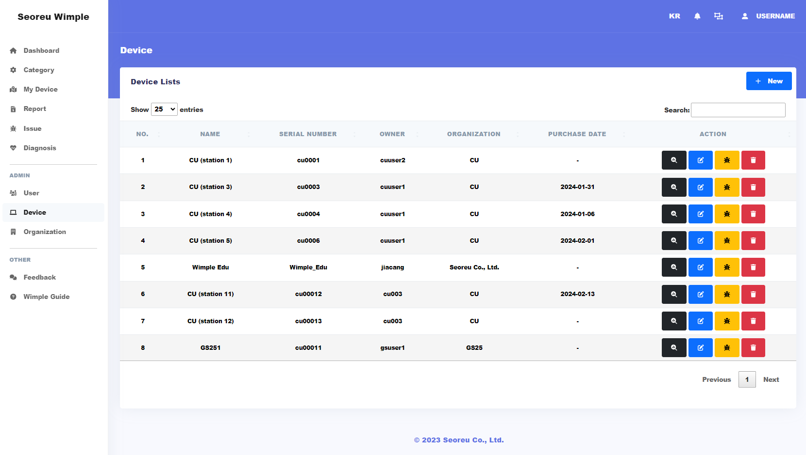
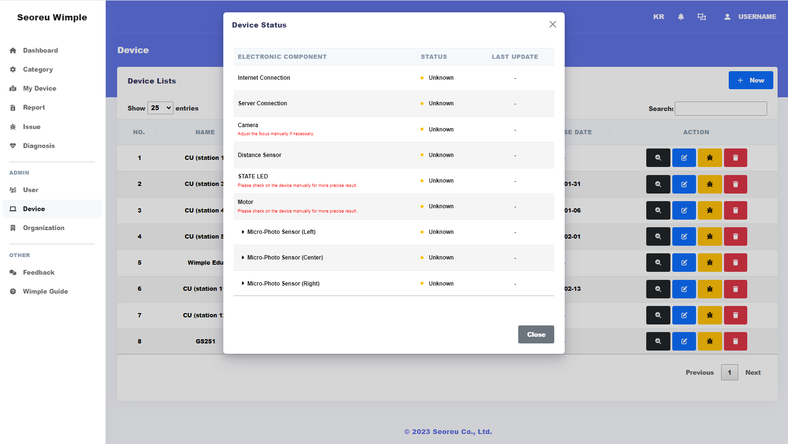
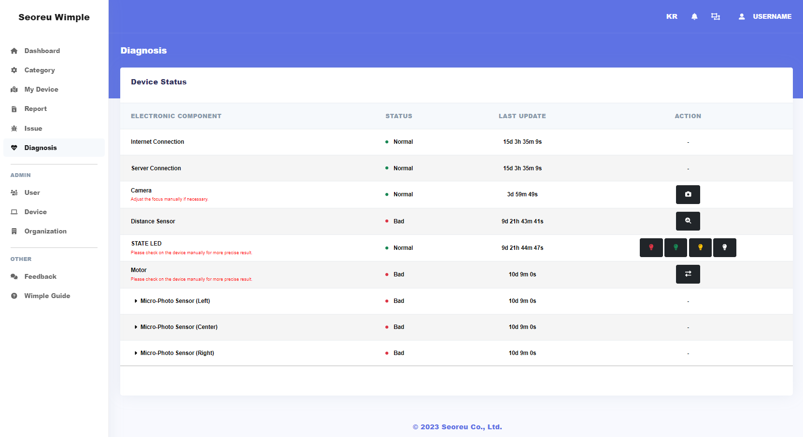
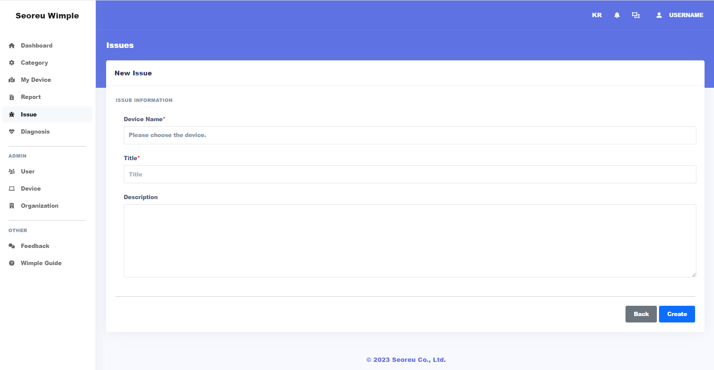
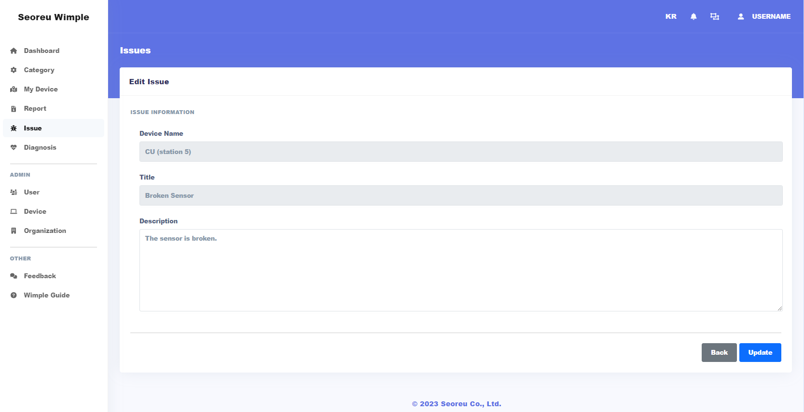
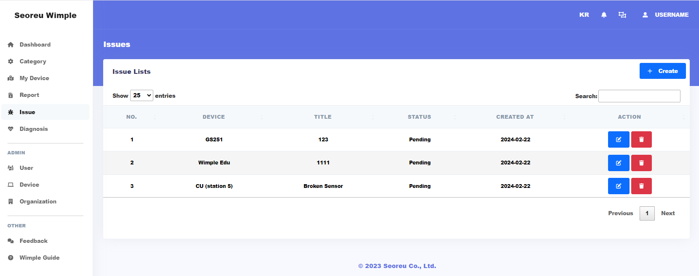
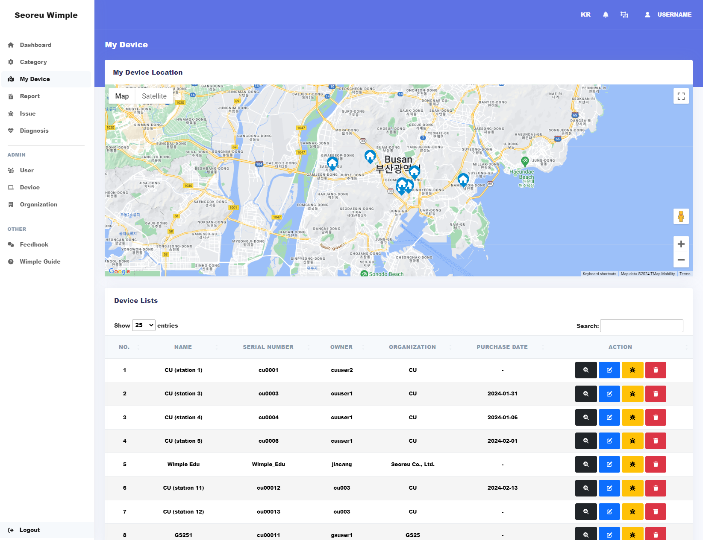
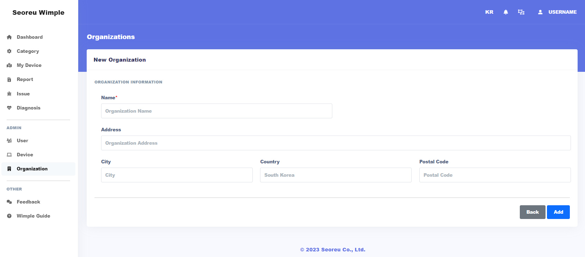
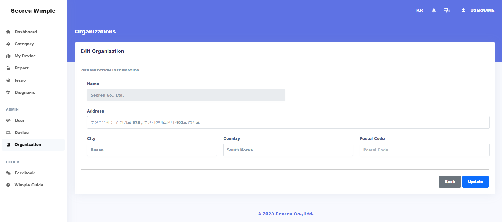
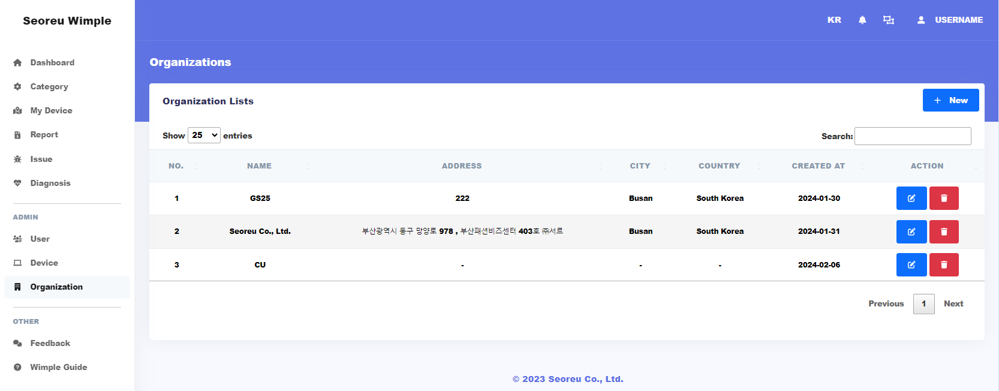
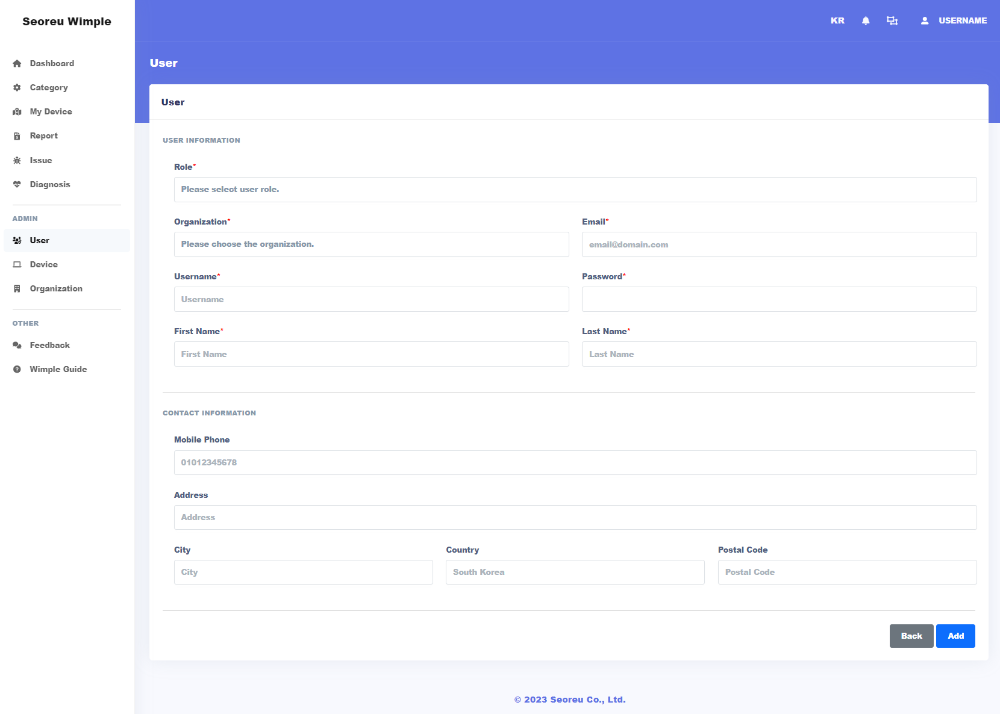
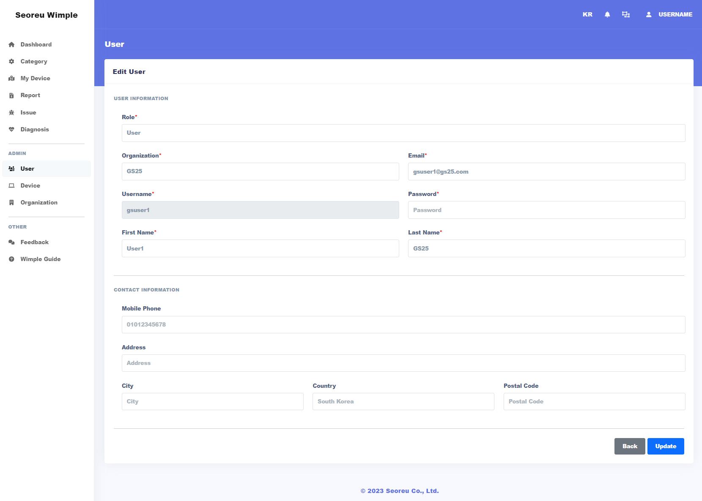
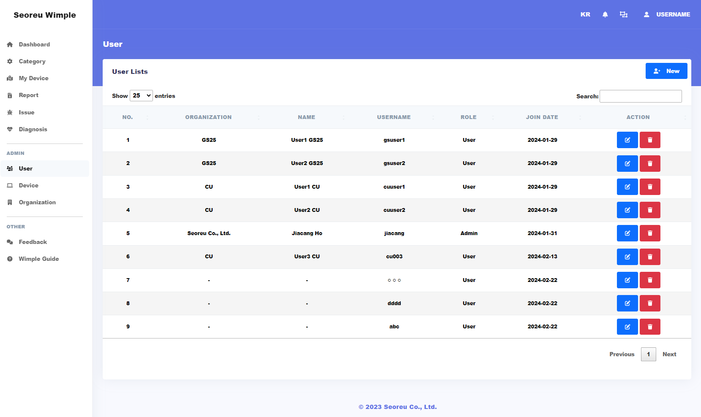
